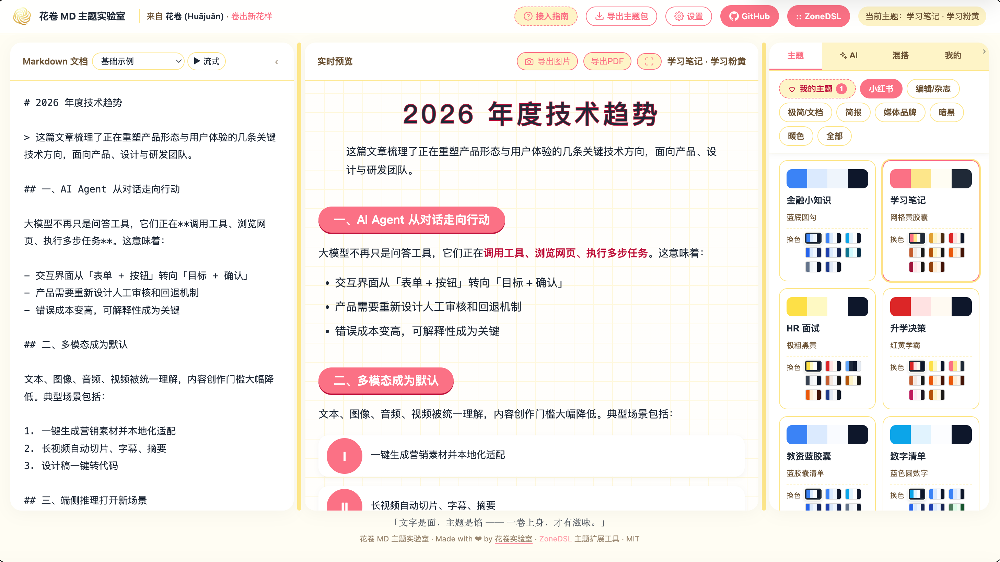

# 🎨 MD Theme Lab

> Markdown 主题实验室 —— ZoneDSL 的主题扩展工具，也可独立使用。

写 markdown，选主题，预览美化效果，导出图片。20+ 主题预设，Design Token 系统，AI 主题/调色板生成，一键导出。设计的主题可导出为 ZoneDSL `.wxss` 主题文件，直接在小程序/Web 中使用。



## 快速开始

### Docker 部署（推荐）

```bash
git clone https://github.com/huajuan-labs/md-theme-lab.git
cd md-theme-lab
cp .env.example .env  # 填入 API key
docker compose up -d  # http://localhost:19527
```

### 本地运行

```bash
npm install
cp .env.example .env  # 填入 API key（或不填，界面齿轮里配）
npm start             # http://localhost:3000
```

### 静态部署（Cloudflare Pages / Vercel）

部署 `public/` 目录。核心功能（编辑 + 主题 + 预览 + 图片导出）全客户端可用，无需后端。AI 功能需自托管。

## API 配置

**两种方式配 API key**：

1. **界面配置**（推荐）—— 点右上角 ⚙ 齿轮按钮，填入 API Key / Base URL / Model / 格式。存在浏览器 localStorage，不清除不丢。
2. **.env 文件** —— 自托管时在 `.env` 里配，所有用户共享。

```env
ANTHROPIC_API_KEY=sk-...                    # 你的 API key
ANTHROPIC_BASE_URL=https://apihub.agnes-ai.com/v1  # OpenAI 兼容或 Anthropic 端点
CLAUDE_MODEL=agnes-2.0-flash                # 模型名
PORT=19527                                  # 端口
```

**支持两种 API 格式**：
- **OpenAI 兼容**（默认）：Agnes / OpenAI / OpenRouter / Ollama 等任何 `/chat/completions` 端点
- **Anthropic**：Claude 原生 `/v1/messages` 格式
- 自动检测：URL 含 `anthropic` → Anthropic，否则 → OpenAI 兼容

> ⚠️ **免费模型延迟提示**：默认配置使用免费模型（如 Agnes），AI 生成（主题/调色板）可能有一定延迟或偶尔失败，属正常现象。用自己的付费 key 体验更稳定。

## 功能

| 功能 | 静态模式 | 全栈模式 |
|---|---|---|
| Markdown 编辑 + 实时预览 | ✅ | ✅ |
| 20+ 主题预设 + 配色变体 | ✅ | ✅ |
| Design Token 可视化调整 | ✅ | ✅ |
| 图片导出（html2canvas） | ✅ | ✅ |
| CSS 主题包导出 | ❌ | ✅ |
| AI 主题生成 | ❌ | ✅ |
| AI 调色板生成 | ❌ | ✅ |
| 主题保存/克隆/历史 | ❌ | ✅ |

## 主题预设

| 风格 | 主题 |
|---|---|
| 杂志 | 杂志、海报、报纸 |
| 实用 | PPT、公众号、极简、简报 |
| 学术 | 学术、清单 |
| 创意 | 时间线、对比、小红书 |
| 领域 | 金融小知识、学习笔记、HR 面试、升学决策、节日科普、设计师禅意、应援签名... |

每个主题支持暖橙/玫粉/深色/企业蓝/海军/炭灰/青绿等配色变体。

## ZoneDSL 联动

md-theme-lab 是 [ZoneDSL](https://github.com/huajuan-labs/zonedsl) 的主题扩展工具。设计的主题可导出为 ZoneDSL 兼容的 `.wxss` 文件：

1. 在 md-theme-lab 中设计/调整主题（可视化 Token + AI 生成 + 实时预览）
2. 导出为 ZoneDSL 主题（变量映射 `--accent` → `--mz-accent` + 选择器适配）
3. 放入 ZoneDSL 的 `packages/wechat/themes/`
4. ZoneDSL 小程序/Web 直接使用新主题

也可独立使用（纯 markdown 排版 + 图片导出），不依赖 ZoneDSL。

## 项目结构

```
md-theme-lab/
├── public/
│   ├── index.html      ← 前端单文件应用
│   └── vendor/         ← marked / morphdom / html2canvas
├── server.js           ← Express 后端（AI + 持久化 + 导出）
├── export-themes.js    ← 主题 CSS 打包导出
├── promax-api.js       ← 设计参考数据 API
├── data/promax/        ← 颜色/样式/字体 CSV
├── Dockerfile          ← Docker 容器化
├── docker-compose.yml  ← 一键部署（端口 19527）
└── .env.example        ← API 配置模板
```

## 技术栈

- **前端**：单 HTML 文件（marked + morphdom + html2canvas），Design Token 系统
- **后端**：Express + SQLite（主题持久化）
- **AI**：双格式支持（OpenAI 兼容 / Anthropic），界面可配 key
- **部署**：Docker / Node / 静态托管

## License

MIT © [huajuan-labs](https://github.com/huajuan-labs)
